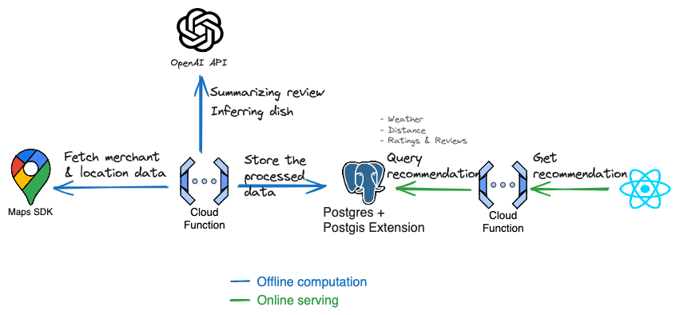

# Project Name

> Recommendation system to empower small vendors with digital marketing power without they needing to do anything

This repository contains multiple projects related to the "terserah" project. The project is created for AngleHack Jakarta 2024.

## System Design

## Project Structure

- **makan**: The main frontend application built with React.
- **makan-api**: The backend API service.
- **makan-worker**: The worker service for handling background tasks.
- **pipeline**: The deployment pipeline configuration.

## makan

This project was bootstrapped with [Create React App](https://github.com/facebook/create-react-app).

### Available Scripts

In the `makan` project directory, you can run:

- `npm start`: Runs the app in development mode. Open [http://localhost:3000](http://localhost:3000) to view it in your browser.
- `npm test`: Launches the test runner in the interactive watch mode.
- `npm run build`: Builds the app for production to the `build` folder.
- `npm run eject`: Ejects the configuration files and dependencies.

For more information, refer to the [Create React App documentation](https://facebook.github.io/create-react-app/docs/getting-started).

### Deployment

Refer to the [deployment documentation](https://facebook.github.io/create-react-app/docs/deployment) for more details.

## makan-api

This project contains the backend API service.

### Deployment

To deploy the API service, use the following command:
